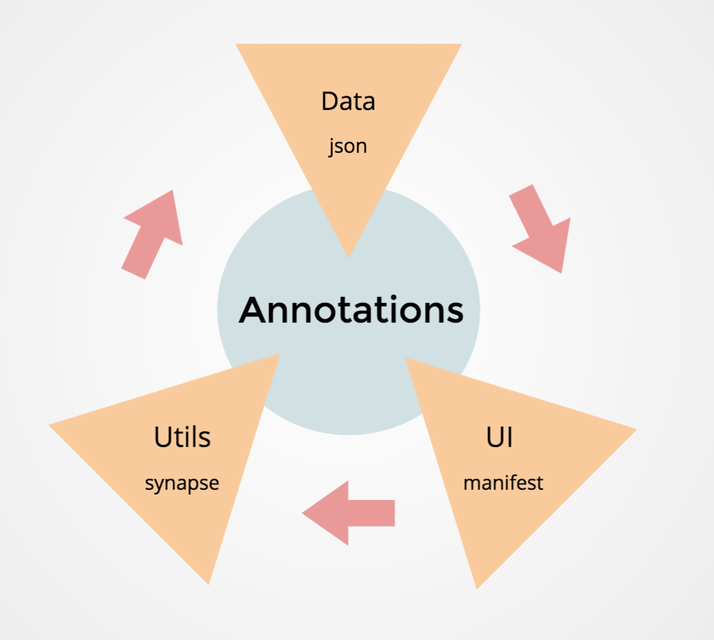

## Annotation UI 
Each study design and analysis requires a unique set of samples or data. In order to both search and access the correct set of samples and ensure proper downstream evaluations annotations are required. Annotations are metadata that provide some information related to the sample and/or data file of interest (ex. 01 tag on a file name represents samples containing solid tumor tissue). Standardizing annotations enables all researchers, including your future self or organization to access and extract data easily. 
 
With a manifest, we can organize the relation between a data file or sample and its associated annotations in our projects.  A manifest is structured as a matrix. The first column is dedicated to a file's unique id on synapse, which allows for each row to represent a unique file. The remaining fields are named by an informative category (ex. Organ) and the entries of that field are filled with values defining a subcategory related to its data file content (ex. brain). 

To create this manifest, a predefined set of annotations is encouraged. 

Over the course of organizing projects at Sage Bionetworks, our scientists have created project specific annotations that are stored as json files on [github](https://github.com/Sage-Bionetworks/synapseAnnotations). This allows for Sage Bionetworks scientists to meet each week, create, and change a consensus vocabulary with proper sources to organize theirs and users projects while versioning the changes. 

To allow for collaboration and common use of vocabularies with other organizations, each week Sage Bionetwork’s json file’s annotations are systematically normalized into a large [melted table or matrix](https://www.jstatsoft.org/article/view/v059i10). This data is then stored on a synapse table. Although the synapse table has strong features, for ease of use, this shiny app pulls the annotation data and creates a table with search, project selection, addition of user specific annotations, and finally manifest creation and download features. 

Given the heterogeneous processes of each organization, in order to join user specific annotations with this data we ask for a minimal standard input: 

### Standard user-input

The schema to capture the one-to-one pairwise key-value relations is defined as: 
 

 key |description| columnType | maximumSize | value | valueDescription | source | project
--- | --- | --- | --- | --- | --- | --- | --- 

The minimum required fields/columns to hold this relation are  

key |value 
--- | ---

The meta-data columnType ,maximumSize, ensures the schema is compatible with synapse. The key and value description and source of description fields ensures common understating of the terminology definitions. 

The app could parse inputs with having one row per unique value (one to one relations with repeating keys) ex.  

key |value 
--- | ---
diagnosis | AML / Acute Myeloid Leukemia 
diagnosis | SecAML / Secondary AML 
diagnosis | CML / Chronic Myeloid Leukemia

or one row per unique keys and a comma separated list of values (one to many relations) ex.

key |value 
--- | ---
diagnosis | AML / Acute Myeloid Leukemia , SecAML / Secondary AML , CML / Chronic Myeloid Leukemia

### Data release information 
[Sage Bionetworks annotations release versions](https://github.com/Sage-Bionetworks/synapseAnnotations/releases)

[Version format and use](https://github.com/Sage-Bionetworks/synapseAnnotations/issues/144)

### Use-case documentation 
`vignettes` folder contains an R markdown with instructive tutorials demonstrating practical uses of the annotationUI shiny app. 

### How to use on a different server 
Replacing the **dat** variable in `global.R` would allow for users to re-define the annotations given the same schema defined as above. 
You can clone or fork this repo and host the app on a private or [shiny server](https://www.rstudio.com/products/shiny/shiny-server/)

### Modular agile flow 

1. Define consensus annotations with definitions and source meta data (Format = versioned json files). 

2. Build your projects’ manifest using a User Interface (UI).

3. Annotate your files on synapse using annotation utils functions (update or audit annotations). 

repeat ...
