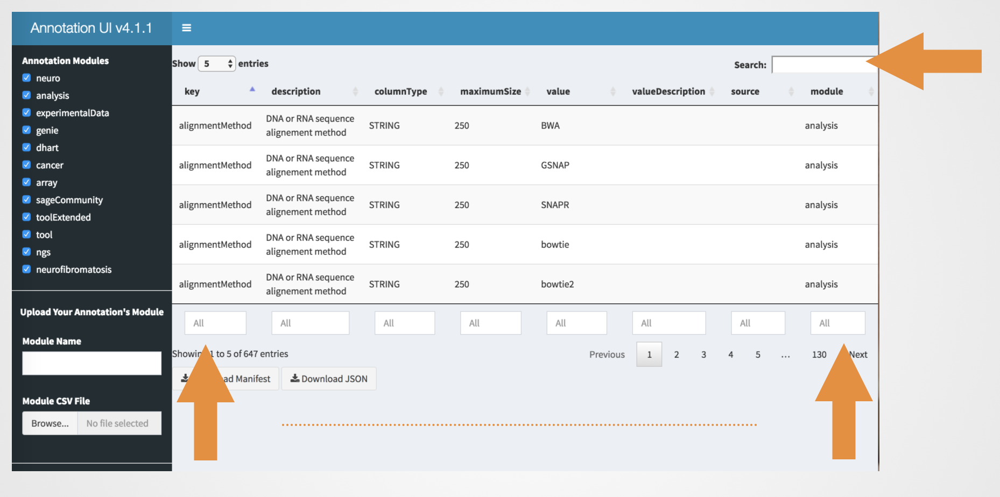
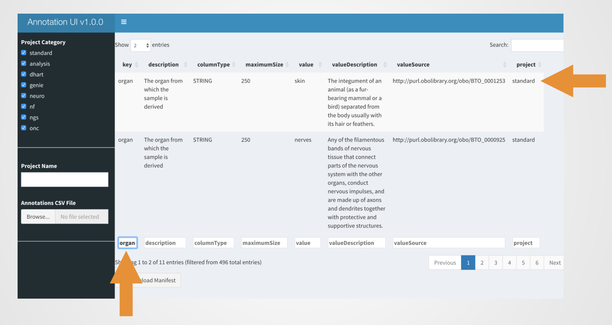
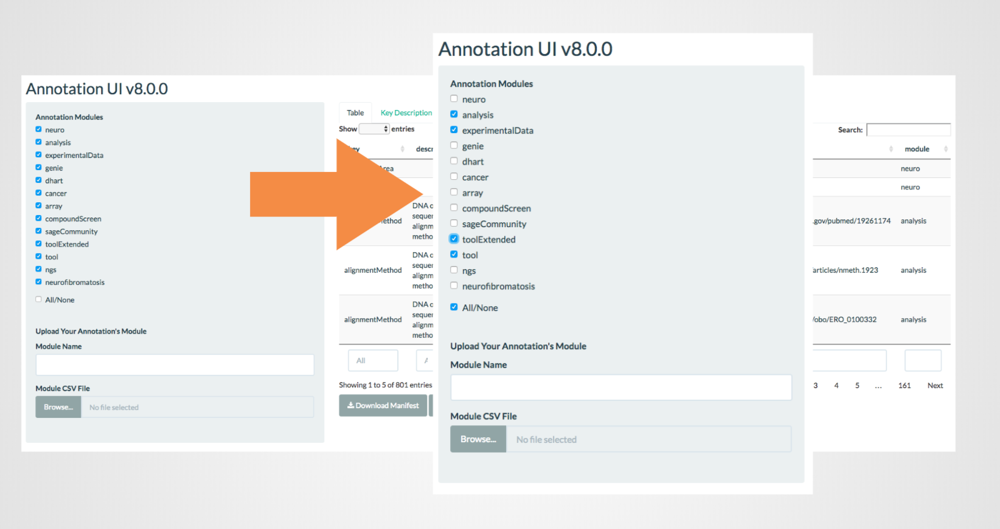
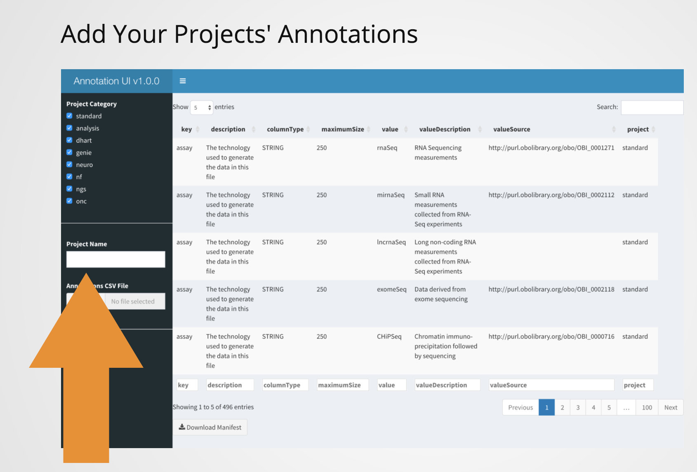
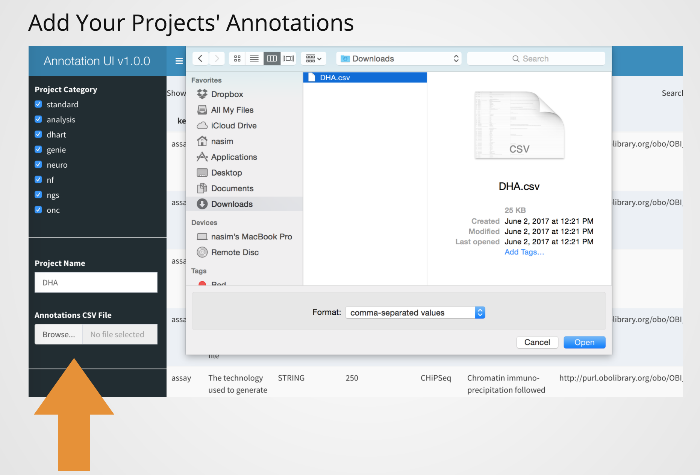
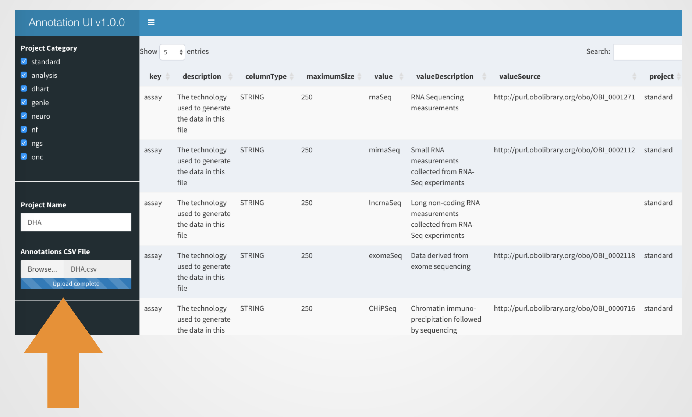
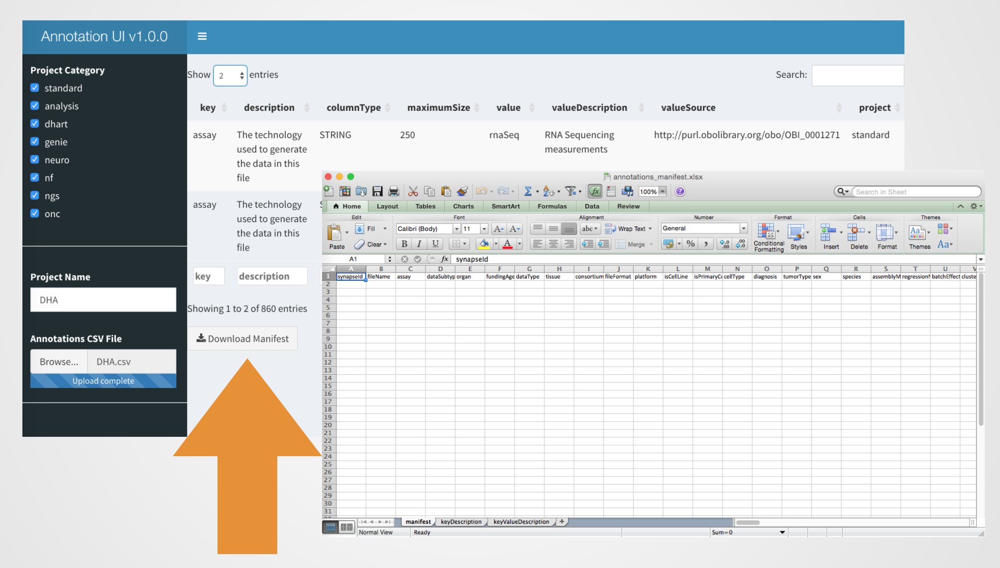
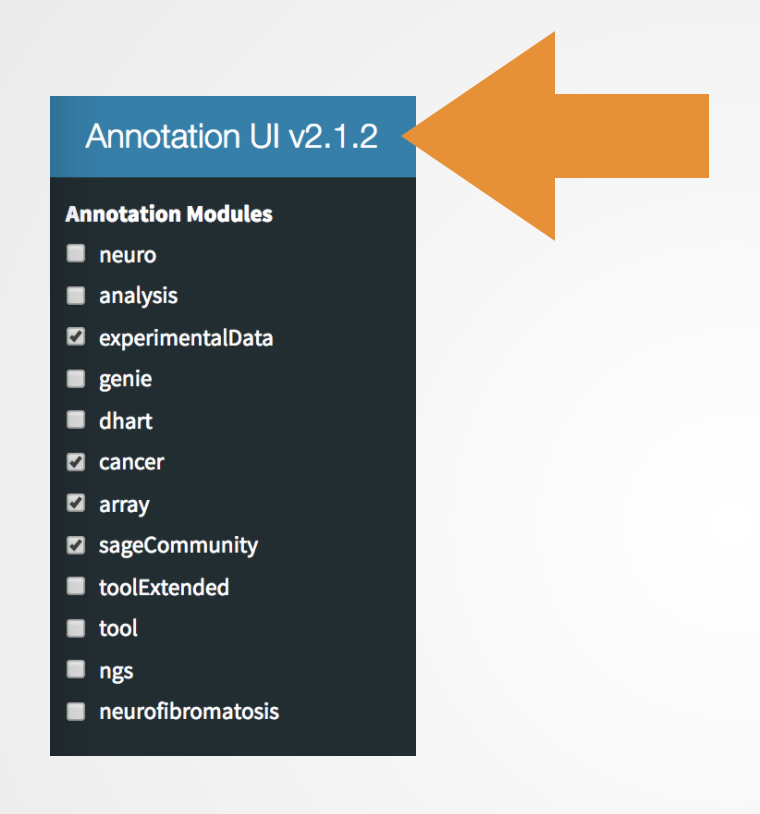

##  Search
Search table globally or by field(s)/column(s)


```{r}
```

Example: searching by column


## Selecting projects 



## Adding to annotations (user specific and non-standardized)
Type in your project's name


Upload annotations csv file


Upload completion message


## Downloading annotation's manifest 
Download button


## Annotation Release versioning 


