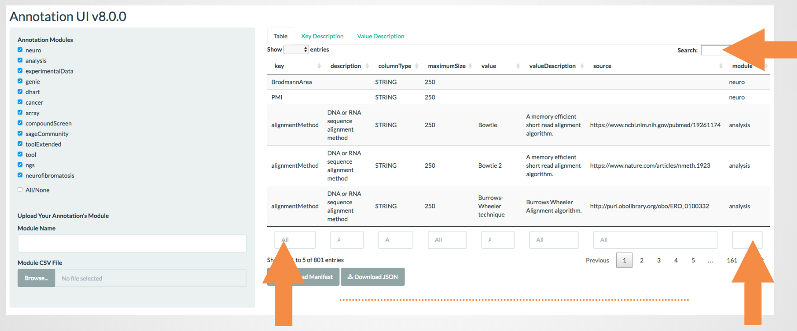

<br>

###Search and find 

#### Search table globally or by field(s)/column(s)



```{r}
```
<br><br>

#### and find the projects containing the annotations that you need (ex. searching by column)


<br><br>

### Select Sage Bionetworks projects

#### Then select those projects. Note that the project categories only list Sage Bionetworks projects annotations that have gone through extensive standardization procedures through scientists.


<br><br>

### Add annotations for manifest construction

#### You can add your projects annotations to the existing annotations. This data would only exist until you have downloaded the manifest. Your annotations for manifest construction (user specific and non-standardized)

#### First you must provide your projects name by typing it in the text box. 


<br><br>

#### then upload your annotations csv file with the minimum of key and value columns by browsing your directories.  


<br><br>

#### you will see a message after your annotations upload has been completed with no errors.


<br><br>

### Download manifest

#### Finally you can download the manifest you created 


<br><br>

### Release versions 

#### Sage Bionetworks annotations have release versions with the latest version being indicated on the shiny app title. Users are encouraged to place the used version number on their projects’ wiki. This will enable auditing the annotations fairly easily.


