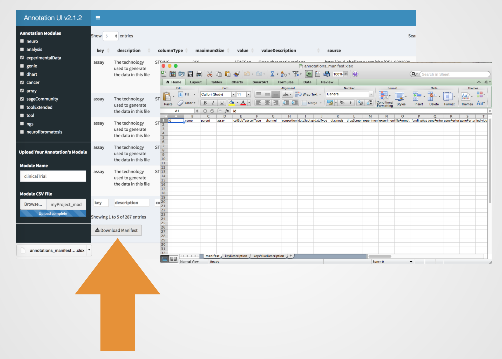

## Basics
### Why annotations?

### What is a manifest? 

## How to Construct a Synapse Annotation Manifest

### Search and Find 
  
Search table globally, top search box, or by field(s)/column(s), bottom search boxes.  
 

 
  
and find the modules containing the annotations that you need for your project (ex. searching by column)  

 

### Select Sage Bionetworks Modules  

You can filter the annotations modules that you need by selecting and deselecting the modules' category checkboxes. Note that the module categories only list Sage Bionetworks annotations that have gone through extensive standardization procedures through scientists.  

### Add Annotations for Manifest Construction  

You can add your own projects' annotations to the existing annotation modules. 

1. Make sure that your projects's annotations module have the minimal fields/columns, _key_ and _value_ with rows formated as:  
a. A key and it's associated values as a comma seperated list: 

 

b. A key and a value in each row with repeating keys for those whom have multiple values: 

 

_Note: This data would only exist on your platform's session for user-defined manifest construction purposes._  

2. Then you must provide your projects' name by typing it in the _text box_. 

 

3. upload your annotations' csv file.  
_NOTE: you must provide a comma seperated csv file._

 

4. you will see a message after your annotations upload has been completed with no errors.

### Download Manifest

Finally you can download the manifest containing the annotations modules. 
on each manifest you will find three excel sheets. 
1. The first sheet is for updating annotations on synapse. 
2. The second sheet is the dictionary for keys. 
3. The third sheet is the dictionary for values. 

### Annotation Module's Data Release Versions 

Sage Bionetworks annotations have release versions with the latest version being indicated on the shiny app title. Users are encouraged to place the used version number on their synapse projects’ annotation. This will enable auditing the annotations over time fairly easily.

For more information please visit: https://github.com/Sage-Bionetworks/synapseAnnotations/blob/master/README.md 

 

